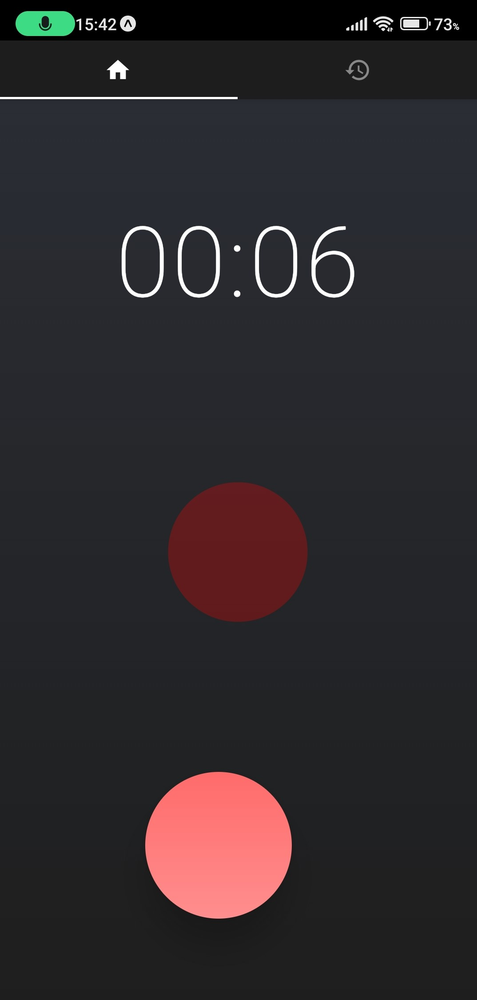
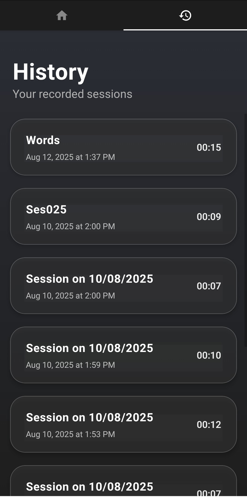
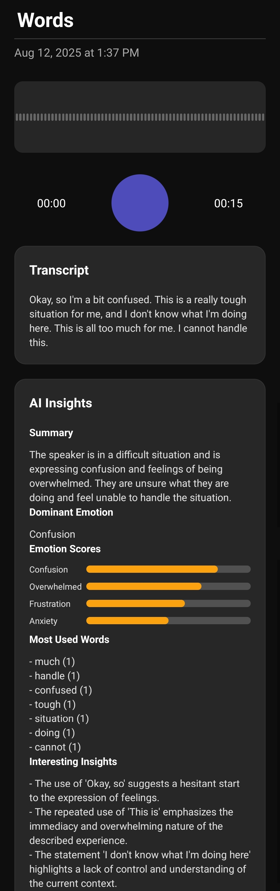

# Speech Insight App

Speech Insight is a mobile application that records your voice, transcribes it, and provides you with AI-powered insights into your speech patterns and emotions.
It uses following AI models:
- Assembly AI for speech to text
- Custom trained model using GoEmotion dataset for emotion analysis
- Gemini for text analysis and summary

## Features

- **Voice Recording:** Easily record your voice with a simple tap.
- **Transcription:** Get accurate transcriptions of your recordings.
- **AI Insights:** Discover insights into your emotions, most used words, and more.
- **History:** Keep track of all your recordings and insights.

## Screenshots

| Recording Screen | Recordings Screen | Recorded Screen |
| :---: | :---: | :---: |
|  |  |  |

## Getting Started

To get started with the Speech Insight app, follow these steps:

1. **Clone the repository:**
   ```bash
   git clone https://github.com/your-username/speech-insight-app.git
   ```
2. **Install dependencies:**
   ```bash
   cd speech-insight-app
   npm install
   ```
3.  **Set up environment variables:**
Create a `.env` file in the `speech-insight-app` directory and add your API keys:
    ```
    ASSEMBLYAI_API_KEY="YOUR_ASSEMBLYAI_API_KEY"
    GEMINI_API_KEY="YOUR_GEMINI_API_KEY"
    ```

4. **Run the app:**
   ```bash
   npm start
   ```

## Contributing

Contributions are welcome! If you have any ideas, suggestions, or bug reports, please open an issue or submit a pull request.

## License

This project is licensed under the MIT License. See the [LICENSE](LICENSE) file for details.
